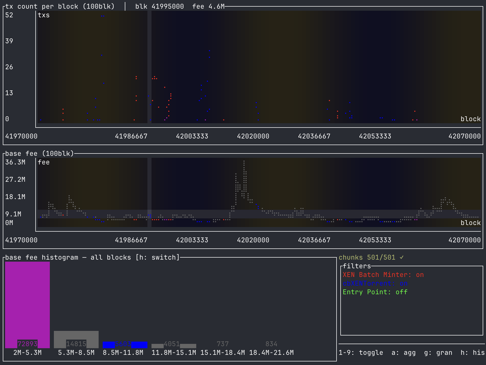

# basescope 🔬

A terminal UI for analyzing transaction activity on Base. Fetches blocks over JSON-RPC, matches transactions against user-defined filters (by sender, recipient, or both), and renders live charts showing tx counts, base fee trends, and fee distribution histograms.



## Features

- **Filter-based tx scanning** — define filters like `to:0x...`, `from:0x...`, or `addr:0x...` with optional labels
- **Live-updating charts** — tx count per block, base fee over time, and base fee histograms update as blocks stream in
- **Color-coded overlays** — each filter gets a distinct color across all charts; overlapping regions blend automatically
- **Aggregate mode** — toggle to union all filter matches into a single series
- **Mouse crosshair** — hover over charts to inspect individual block values
- **Chunk-level caching** — fetched block data is cached to disk as bincode, so re-scanning the same range is instant
- **Multi-RPC support** — round-robin across multiple endpoints with automatic scoring/failover
- **Adjustable granularity** — group blocks in buckets of 1 to 10000+, with auto-scaling based on block range; affects both line charts and histograms

## Install

```
cargo install --path .
```

Or build from source:

```
cargo build --release
```

## Usage

### Interactive

```
basescope
```

The TUI walks you through entering a block range and adding filters. Filters use the format:

```
label=to:0xADDRESS
label=from:0xADDRESS
label=addr:0xADDRESS
```

The label is optional — if omitted, the filter expression itself is used.

### CLI

Skip the input screens by passing everything up front:

```
basescope \
  --start-block 42000000 \
  --end-block 42010000 \
  --filter "uniswap=to:0x3fC91A3afd70395Cd496C647d5a6CC9D4B2b7FAD" \
  --filter "from:0x000000000000000000000000000000000000dEaD"
```

### Configuration

All CLI flags can be set via environment variables or a `.env` file:

| Variable | Default | Description |
|---|---|---|
| `BASESCOPE_RPC_URLS` | `https://mainnet.base.org` | Comma-separated RPC endpoints |
| `BASESCOPE_DATA_DIR` | `./data` | Where cached block data is stored |
| `BASESCOPE_CONCURRENCY` | `10` | Max concurrent RPC requests |
| `BASESCOPE_START_BLOCK` | — | Start of block range |
| `BASESCOPE_END_BLOCK` | — | End of block range |

### Keybindings

| Key | Action |
|---|---|
| `1`–`9` | Toggle individual filters on/off |
| `a` | Toggle aggregate mode |
| `g` | Cycle granularity (1 → 10 → 100 → 1000 → auto → 1) |
| `G` | Set custom granularity (number or "auto") |
| `h` | Switch histogram between filter matches and all blocks |
| `s` | Cycle base fee Y-axis scale (linear → log → sqrt) |
| `l` | Toggle log panel |
| `r` | Toggle RPC info panel |
| `q` | Quit |

Mouse movement over the top two charts shows a crosshair with block number and base fee.

## Architecture

```
main.rs           CLI parsing, terminal setup
domain.rs         Core types (filters, blocks, chunks, snapshots)
rpc/              Alloy-based JSON-RPC client with multi-endpoint scoring
cache/            Bincode chunk cache on disk
pipeline/         Concurrent block fetching with progress events
analysis/         Incremental filter matching and histogram computation
tui/              Ratatui app loop, event handling, rendering
```

## License

[The Unlicense](https://unlicense.org/) — public domain.
